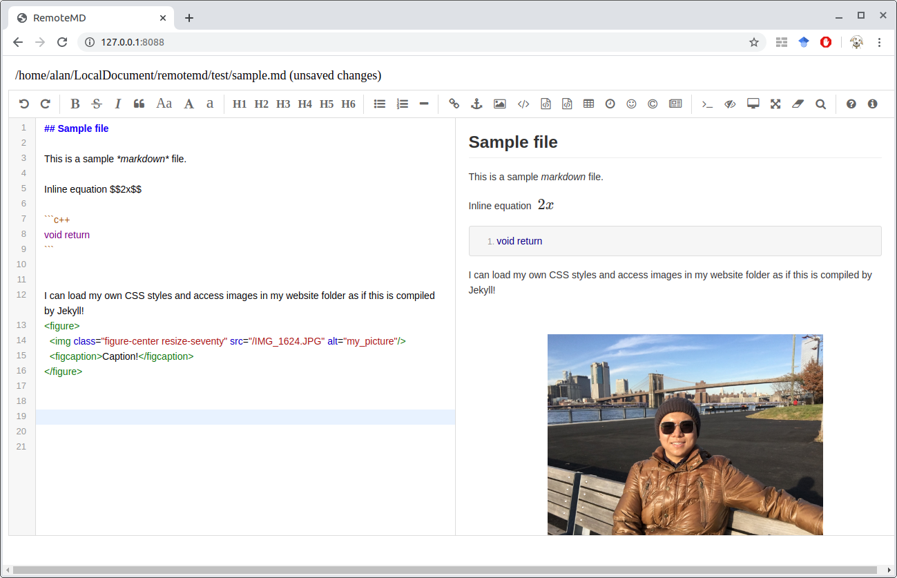

# RemoteMD: WYSIWYG Markdown Editing Server


Based on [editor.md](https://github.com/pandao/editor.md), RemoteMD is a web-based
WYSIWYG markdown editing solution. It is great for writing markdown websites with
static website generators like Jekyll. By configuring the directories correctly, 
you can see the real-time output of your Jekyll posts without waiting for HTML generation. 




## Usage

- Run the server for a particular file:
```
python3 remotemd.py ./test/sample.md
```

- Run the server for a particular file using a specified config file:

```
python3 remotemd.py ./test/sample.md -c ./test/_config.json
```

- Access the editor at <http://127.0.0.1:8088> by default.

- Press Ctrl+S to save the file.


## The config JSON

You can set up the IP address and port number of the server. Additionally:

- `base_dir`: the root directory of your website
- `additional_header`: additional lines in the HTML header. You may put your own JavaScript
and CSS here.

`./test/gen_config.py` shows hot to generate the config file.


## Warnings
- Liquid expressions will not be processed.
- Please make sure only one session is used. Opening multiple sessions at the same time will lead to inconsistencies.
- Since editor.md also parses HTML tags, it is very dangerous for outsiders to have access to the editor. Always keep 
the server private! 
